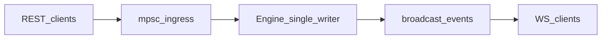

# Orderly

Off-chain **central limit order book (CLOB)** and matching engine in Rust: price-time priority, limit and market orders, partial fills, cancellations, REST + WebSocket market data, and throughput/latency benchmarks.

## Features

- **Price-time priority** — best price first; FIFO at the same price level
- **Limit orders** — rest on the book until matched or cancelled
- **Market orders** — walk the book; unfilled remainder is cancelled (`cancelled_qty` in the response)
- **Partial fills** — one trade record per counterparty touch at the **maker** price
- **Single-writer engine** — all mutations through one async task (deterministic matching)
- **REST API** — place, get, cancel, order book snapshot, recent trades
- **WebSocket** — `trade` events and incremental `bookdelta` updates (full `book` snapshot on connect)
- **Benchmarks** — Criterion micro-benchmarks + concurrent load harness (p50/p95/p99)

## Repository layout

```
orderly/
  crates/
    orderly-core/    # Matching engine (no async, no HTTP)
    orderly-server/  # Axum REST + WebSocket
    orderly-bench/   # Criterion + orderly-load binary
```

## Quick start

```bash
cargo run -p orderly-server
```

Listens on `http://0.0.0.0:8080` unless `PORT` is set. For permissive browser CORS in development: `ORDERLY_DEV_CORS=true`.

### Example requests

```bash
curl -s -X POST http://localhost:8080/v1/orders \
  -H 'Content-Type: application/json' \
  -d '{"side":"ask","type":"limit","price":100,"qty":10}'

curl -s -X POST http://localhost:8080/v1/orders \
  -H 'Content-Type: application/json' \
  -d '{"side":"bid","type":"limit","price":100,"qty":10}'

curl -s http://localhost:8080/v1/orderbook?depth=20
```

WebSocket: connect to `ws://localhost:8080/v1/ws`, then subscribe:

```json
{"op":"subscribe","channels":["trades","book"]}
```

### Benchmarks

```bash
cargo bench -p orderly-bench
cargo run -p orderly-bench --release --bin orderly-load -- --concurrency 32 --duration-secs 5
```

## HTTP API

| Method | Path | Description |
|--------|------|-------------|
| `GET` | `/health` | Liveness |
| `POST` | `/v1/orders` | Place limit or market order |
| `GET` | `/v1/orders/{id}` | Order status and quantities |
| `DELETE` | `/v1/orders/{id}` | Cancel resting order |
| `GET` | `/v1/orderbook?depth=N` | L2 snapshot (default 20, max 100) |
| `GET` | `/v1/trades?limit=N` | Recent trades (in-memory ring) |
| `GET` | `/v1/ws` | WebSocket market data |

**Limit order**

```json
{
  "side": "bid",
  "qty": 10,
  "client_order_id": 42,
  "type": "limit",
  "price": 100
}
```

**Market order**

```json
{ "side": "bid", "qty": 5, "type": "market" }
```

Prices and quantities are unsigned integers (no floats).

## Architecture



`orderly-core` owns the book and matching loop. `orderly-server` serializes commands on a Tokio task and fans out `Trade` and `BookDelta` events.
